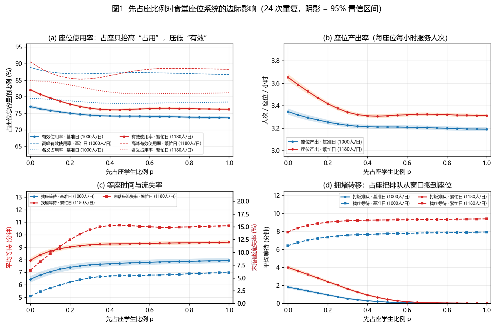
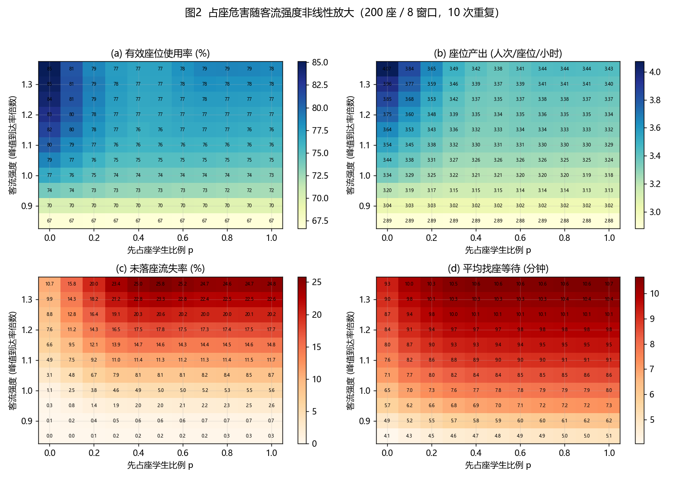
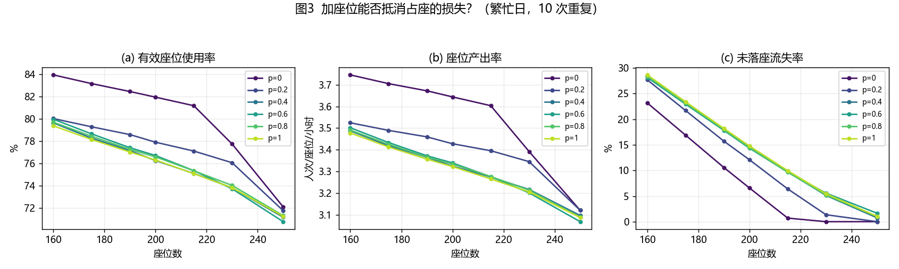
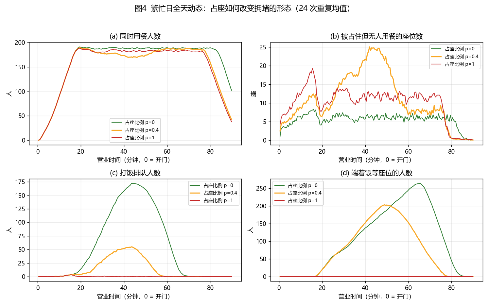
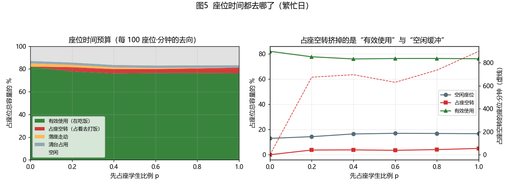
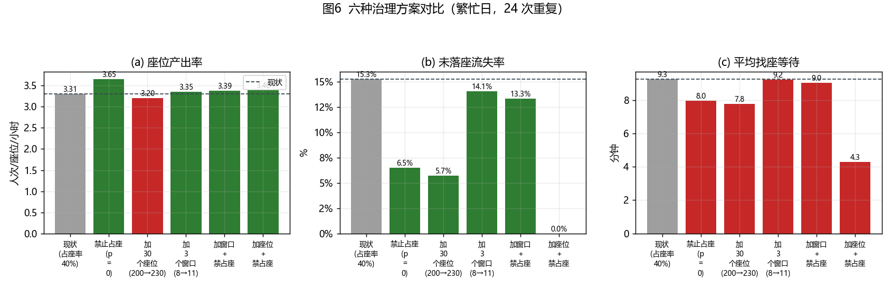
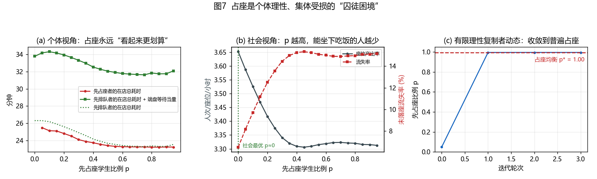
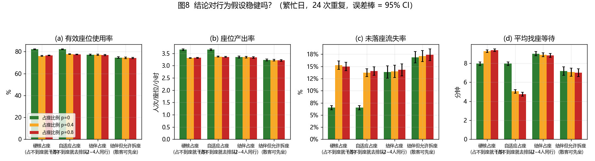
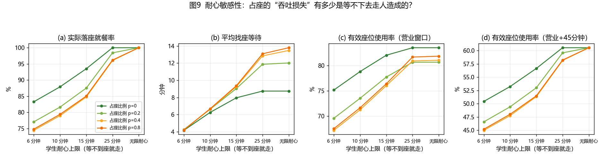

# 食堂「先占座再排队打饭」仿真与分析

用**离散事件仿真**量化一个具体的校园问题：学生先放下书包占座、再去窗口排队打饭，会不会降低座位使用率？降多少？在什么条件下最严重？该怎么治？

支持 Python（研究/批量实验）与 JavaScript（浏览器交互沙盘）两套等价实现。

---

## 核心结论

在繁忙日情景下（约 1180 人/日、200 座、8 窗口、学生耐心 15 分钟），把「先占座」学生的比例从 0 提到 40%：

| 指标 | p = 0（先排队） | p = 40%（现状） | 变化 |
|---|---|---|---|
| **有效座位使用率**（座位上真有人在吃饭的时间占比） | 82.1% | **76.0%** | **−6.1 pp** |
| **座位产出率**（每座位每小时服务人次） | 3.65 | **3.31** | **−9.3%** |
| 占座空转（被占住但没人在吃） | 0 | **3.9 pp** | 相当于每天浪费 ~11.6 座位·小时 |
| 平均找座等待 | 7.95 min | **9.26 min** | +16% |
| 平均打饭排队 | 4.01 min | **0.94 min** | −77%（窗口在闲置） |
| 未落座流失率 | 6.5% | **15.3%** | **×2.35** |
| 实际就餐人数 | 1096 | **993** | **−103 人/日** |

**一句话机制：占座把「打饭排队的等待」搬运成了「座位被占用的时间」，于是打饭窗口空转、座位产能被吃掉，而座位恰好是这家食堂的高峰瓶颈。**

### 四个反直觉的发现

1. **瓶颈被搬家了**：占座清空了打饭队列（4.01 → 0.94 min），拥堵转移到座位端。此时**加打饭窗口几乎无效**（+1.4%）——无论学生耐心是 8 分钟还是无限，加窗口都不增加就餐人数。
2. **日均产能只降 3%，实际服务人数却降 9.4%**。手算核算式（持座时长 = 用餐 + 占座比例 × 排队时长）与仿真吻合到 1.5pp 以内，说明损失来自**高峰期仅剩的 5% 缓冲被吃掉**，而非日均产能不足。
3. **「平均等待时间」会骗人**：占座后人均等待反而从 4.72 降到 2.31 分钟，因为等不下去的人直接走了、不再计入等待统计。评估必须看流失率与座位产出。
4. **占座是囚徒困境**：在任何 p 上个人占座都占优（省时 + 免于 8.4 分钟端盘转圈），有限理性复制者动态收敛到 p\* ≈ 1.0，而社会最优是 p = 0。

### 两条有条件的结论

- **危害随拥挤非线性放大**：客流强度 0.9 时 −0.5pp，1.35 时 −6.6pp、产出 −15.8%。冷清食堂里占座几乎无害。
- **吞吐损失部分取决于学生耐心**：无限耐心时所有人都能吃上饭、总产出不变，代价是多等 3~5 分钟（找座等待 +54%）；耐心 15 分钟时等待才转化为 8.8pp 的额外流失。而「占座空转 ~4pp」与「找座等待上升」是与耐心无关的硬事实。

完整推导、9 组实验与稳健性检验见 **[食堂占座仿真分析报告.md](食堂占座仿真分析报告.md)**。

---

## 快速开始

### 交互式可视化沙盘（推荐先看这个）

直接用浏览器打开单文件沙盘，**无需联网、无需安装任何依赖**：

```
食堂仿真沙盘.html
```

把同一套模型移植到了 JavaScript，左侧实时调参、右侧立刻出结果：

- **8 张指标卡**，每张都标注「对比禁占座」的增量（同一随机种子，可直接归因于占座）
- **食堂平面图动画**：座位逐格变色（空座 / 被占住没人在吃 / 正在用餐 / 清台中），上方窗口与打饭队列，下方「端盘等座」与「占座前等位」人群；可播放/拖动时间轴，并一键切换 **「当前设定」vs「对照：禁止占座」** 两条世界线
- **全天动态图**、**座位时间预算堆叠对比**、**p 扫描曲线**、**客流 × 占座相图热力图**

单次仿真约 3 ms，默认 8 次重复 + 11 点扫描 + 同种子对照 **≈ 0.6 秒**完成重算。

### 复现全部实验与图表

```bash
pip install numpy pandas matplotlib
cd canteen_seat_sim
EXP=all python experiments.py     # E1~E9，约 3 分钟，输出 results/*.csv 与 figures/*.png
python summary.py                 # 汇总所有数字到 results/summary.txt
```

---

## 目录结构

```
.
├── 食堂仿真沙盘.html    # ★ 交互式可视化界面（单文件、零依赖、双击即用）
├── 食堂占座仿真分析报告.md  # 完整分析报告（建模 / 9 组实验 / 机制解析 / 管理建议 / 局限）
├── model.py            # 仿真内核：离散事件引擎 + 三套指标口径
├── experiments.py      # E1~E9 实验与出图
├── calibrate.py        # 参数标定量级检查
├── probe.py            # 参数敏感性探针
├── robust.py           # 加窗口 / 学生耐心的稳健性检验
├── summary.py          # 数字汇总
├── verify_js.js        # 校验 HTML 内嵌 JS 引擎与 model.py 是否等价
├── check_html.js       # HTML 静态检查（语法 / DOM 契约 / 指标字段）
├── smoke_ui.js         # UI 冒烟测试（最小 DOM 桩上真实执行全部交互路径）
├── results/            # 9 份 CSV + summary.txt + robustness.txt
├── figures/            # fig1 ~ fig9
└── qa/                 # 三项自动化验收的原始输出
```

---

## 方法要点

| 要素 | 实现 |
|---|---|
| 引擎 | 离散事件仿真（事件堆），时间单位 = 分钟 |
| 客流 | 非齐次泊松过程（细化法抽样），峰值 27.6 人/分，峰宽 σ = 18 min |
| 座位 | 200 座；占座/落座 → 吃饭 → 离开 → 清台 0.4 min（期间不可用） |
| 打饭 | 8 窗口并联 FIFO，服务时长对数正态（均值 25 s，CV 0.4） |
| 用餐 | 对数正态，均值 14 min，CV 0.3 |
| 等待规则 | 座位先到先得；等座超过耐心上限（默认 15 min）→ 放弃离开 |
| 随机性 | 多条独立随机流 + **共同随机数（CRN）**，24 次重复 + 95% 置信区间 |

**指标口径**（报告的核心，三者必须区分）：

```
名义占用率 nominal  = 座位"被占住"的时长 / 座位总容量
有效使用率 effective = 座位上"确实有人在吃饭"的时长 / 座位总容量   ← 真正的产出
占座空转   idle_pre = 名义 −（有效 + 落座走动）                    ← 占座行为的直接代价
座位产出率          = 每座位每小时服务的人次
```

食堂张贴的「上座率」通常是**名义占用率**。占座能推高名义占用率，却压低有效使用率——两者的背离正是问题被长期忽视的原因。

---

## 图表

| 图 | 内容 |
|---|---|
|  | **图1** 占座比例 p 对利用率／产出／等待／流失的影响（含 95% CI） |
|  | **图2** p × 客流强度 相图：危害非线性放大 |
|  | **图3** 座位供给 × 占座比例：加座位能买缓冲，不能消除机制 |
|  | **图4** 繁忙日全天动态：拥堵如何从窗口转移到座位 |
|  | **图5** 座位时间都去哪了（吃饭／占座空转／走动／清台／空闲） |
|  | **图6** 六种治理方案对比 |
|  | **图7** 占座的囚徒困境：个体理性收敛到普遍占座 |
|  | **图8** 行为假设稳健性（含结伴就餐） |
|  | **图9** 耐心敏感性：吞吐损失有多少来自「等不下去走人」 |

---

## 自动化验收

`qa/` 目录保留了原始输出：

1. **JS 引擎 vs Python 模型等价性**：同场景各 24 次重复，7 项指标全部落在蒙特卡洛误差内（有效使用率 Δ0.005、座位产出 Δ0.018、占座空转 Δ0.000、找座等待 Δ0.32 min、流失率 Δ0.011、就餐人数 Δ5 人）。
2. **HTML 静态检查**：脚本语法、36 个 DOM id 引用、`data-*` 契约、UI 引用的指标字段、座位时间预算加总恒为 100%。
3. **UI 冒烟测试**：在最小 DOM/Canvas 桩上真实执行两个脚本块，8 张 KPI 卡渲染完整且无 `NaN`，平面图 200 座位 + 8 窗口绘制齐全，7 条交互路径全部无异常。

> 沙盘使用 splitmix32 随机源（Python 端为 numpy PCG64），因此数值是**统计等价**而非逐位复现；关键结论在浏览器中与报告完全一致。

---

## 管理建议（按性价比排序）

| 优先级 | 措施 | 依据 |
|---|---|---|
| ★★★ | **明确禁止用物品占座**（人未到不得占座），配合现场规则与广播 | 座位产出 +10.4%，就餐人数 +103 人/日，零硬件成本 |
| ★★★ | **分离「候餐区」与「就餐区」**：先取餐、后在候餐区等位叫号 | 直接消灭 ~4pp 的占座空转 |
| ★★☆ | **提高翻台率**：清台提速、餐盘回收点前置 | 每缩短 1 min 用餐/清台，产能提升约 7% |
| ★★☆ | **错峰引导**：分时段下课、高峰折扣/预约 | 危害随客流强度非线性放大 |
| ★★☆ | **大桌/连座资源单独管理**（拼桌引导、4 人桌预留） | 结伴就餐影响量级（−4.9pp）大于占座本身 |
| ★☆☆ | **增加座位** | 流失率 14.7% → 5.1%，但需与禁占座配套 |
| ☆☆☆ | 增加打饭窗口 | **在座位瓶颈下基本无效**，应先确认瓶颈在窗口还是座位 |

---

## 局限

- 未建模**结伴学生的分工行为**（一人占座、同伴打饭）——这是一种「合法化的占座」，会削弱禁令效果。
- 座位分配采用先到先得 + 严格连坐，未考虑拼桌协商、熟人让座等社交机制。
- 未建模价格/预约机制，也未考虑食堂之间的替代效应。
- 单食堂、单餐段、需求外生；内生化均衡（图7）为近似求解。

## 许可

未附许可证，保留所有权利。如需开源请自行添加 LICENSE。
